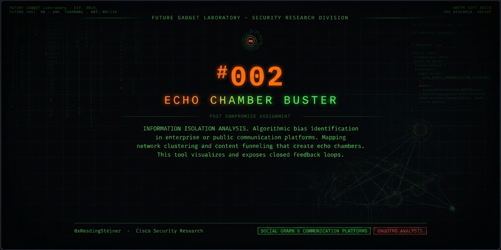

# Echo Chamber Buster



Identify bot and astroturf accounts in Reddit archive data.

Echo Chamber Buster analyzes the full public history of a Reddit
account and scores the likelihood that it is automated or coordinated.
It is intended for researchers and analysts who need to filter bot
activity out of archive datasets before analysis or model training.

## How it works

For each username it pulls the complete public history — comments and
posts — from independent archives (Arctic Shift, with PullPush as a
fallback for older years) plus account metadata from Reddit's public
profile endpoint, and scores ten behavioral signals:

| Signal | Description |
|--------|-------------|
| Dark gaps | Long dormancy periods between activity, including time between account creation and first post |
| Burst | Sudden spike in posting rate after a silence, far above the lifetime average |
| Content spam | Near-duplicate posts, gif-only and one-liner comment floods |
| Single purpose | High concentration of activity in one subreddit or topic |
| Accused | Community replies calling the account a bot or shill |
| Newbie lie | "First comment" claims contradicted by the account's own archive |
| Karma farming | Explicit karma begging, free-karma subreddit activity |
| Scrubbing | Discrepancy between archived item count and displayed karma |
| Karma age | Karma density relative to account age |
| Decisive duplication | Extreme near-duplicate posting (≥20 pairs covering ≥15% of posts) |

Scores range 0–100: **LOW** (0–39), **ELEVATED** (40–64), **HIGH**
(65–100). A HIGH verdict requires at least three independent strong
signals, or duplication at decisive scale. Every score includes the
evidence lines that produced it, so results can be audited.

Signal thresholds were calibrated against a set of organic control
accounts to keep the false-positive rate low.

## Usage

### Batch scanner (dataset filtering)

Requires Node.js ≥ 18.

```bash
node cli/scan.js authors.txt > scan-results.jsonl
```

`authors.txt` is one username per line — for example, the distinct
authors of an archive pull. Output is one JSON record per line:

```json
{"username":"example_user","index":92,"band":"high","signals":{"darkGaps":1,"burst":1,"contentSpam":1},"evidence":["dark gaps: 309d, 125d, 57d"],"dataQuality":{"comments":310,"posts":69}}
```

Filter a dataset with, for example:

```bash
jq -r 'select(.band == "high") | .username' scan-results.jsonl > exclude.txt
```

Options: `--min N` prints only scores ≥ N. Band counts are printed to
stderr. Rate-limited to one request per 1.2 seconds against the public
archives.

### Browser extension

1. Download `Extension.zip` from Releases.
2. Unzip it.
3. Chrome → `chrome://extensions` → enable Developer mode →
   Load unpacked → select the folder.
4. Open a Reddit page. Scores appear next to usernames; clicking a
   badge shows the score, signals, and evidence.

## Data and privacy

- Reads public data only: Reddit pages and public archives.
- Never posts, votes, or otherwise interacts with accounts.
- The extension caches results locally in the browser (7-day TTL).
  No telemetry, no external collection. See [PRIVACY.md](PRIVACY.md).
- The CLI writes only the files you direct it to.

## Limitations

Scores are heuristic estimates computed from public data. They are not
proof of identity, intent, or wrongdoing. False positives and false
negatives are possible — review the evidence lines before acting on a
score.

## License

MIT. See [LICENSE](LICENSE).
